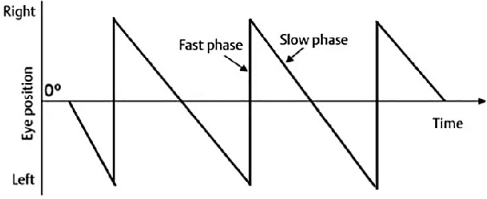

# Nystagmus Classification Guide

This module will guide how to classifying and diffrentiate different type of nystagmus. While there is power point that already being used for training, this will be more specify how to classifying nystagmus based on our video cases. If you have not look the [presentation](https://docs.google.com/presentation/d/18QXRZ6JaWvDRPeyxUxeMI_iZjH5-vG_FZZ7ga2mPUsY/edit?usp=sharing) (if you can't access the slides please let any team member know). please take a look the presentation first for general information of Benign Paroxysmal Positional Vertigo. 

The direction of involuntary eye movement is determined by the gradient of the **fast phase**. To justitfy if the movement is actually nystagmus, required at least 2 beating movement with the same (approximately speed) and direction.

As already mentioned, there are 6 type of nystagmus movement. Please watch for each examples of the type movement below. Note that for some of the example in the actual dataset video might be not clear (lot of blinks, eye closed, the iris seems really small) and if that is the cases, we might not use that video for the sake of good dataset for machine learning algorithm.
- [Upbeat](#upbeat)
- [Downbeat](#downbeat)
- [Left Beat](#left-beat)
- [Right Beat](#right-beat)
- [Mixed](#mixed)
- [Rotational](#rotational)

## Upbeat
<video width="400" height="300" controls>
  <source src="assets/media/nystagmus_guide/upbeat_example.mp4" type="video/mp4">
  Your browser does not support the video tag.
</video>

## Downbeat
<video width="400" height="300" controls>
  <source src="assets/media/nystagmus_guide/downbeat_example.mp4" type="video/mp4">
  Your browser does not support the video tag.
</video>

## Left Beat
<video width="400" height="300" controls>
  <source src="assets/media/nystagmus_guide/left_beat_example.mp4" type="video/mp4">
  Your browser does not support the video tag.
</video>

## Right Beat
<video width="400" height="300" controls>
  <source src="assets/media/nystagmus_guide/right_beat_example.mp4" type="video/mp4">
  Your browser does not support the video tag.
</video>

## Mixed
<video width="400" height="300" controls>
  <source src="assets/media/nystagmus_guide/rotational_example.mp4" type="video/mp4">
  Your browser does not support the video tag.
</video>

## Rotational

