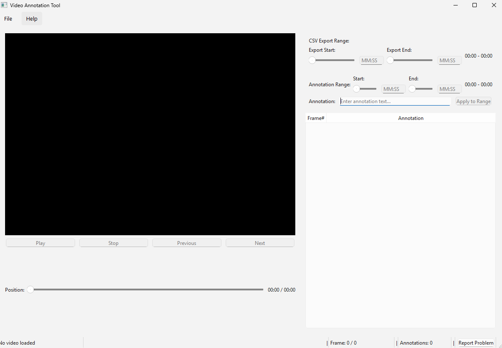
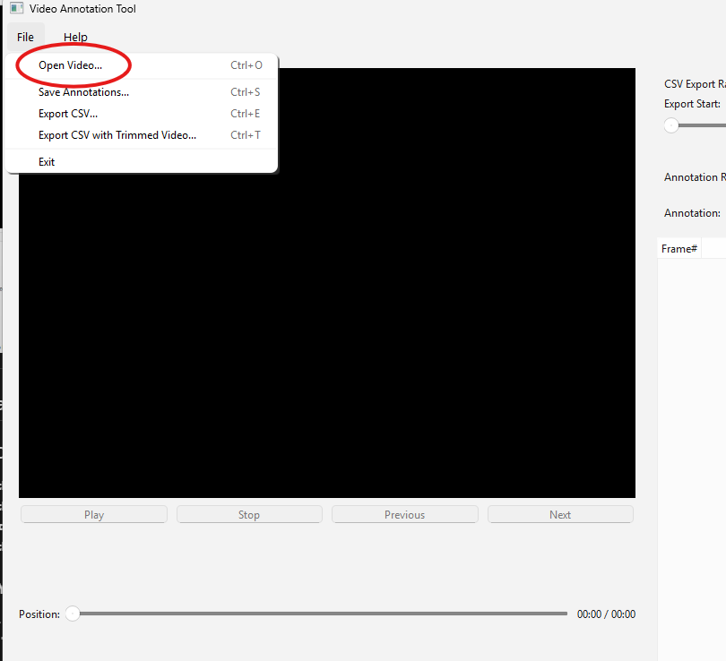
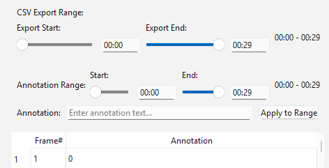
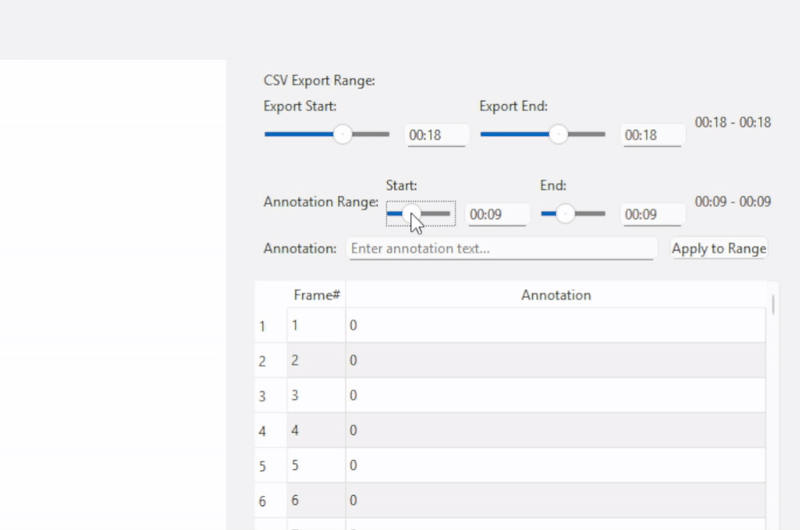
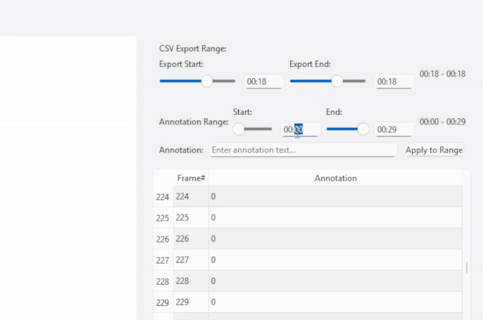

# Video Annotation Tool - Simple User Guide

## 🎬 Welcome to Video Annotation Tool!

This guide will help you use the Video Annotation Tool to mark nystagmus movement in the videos and save them as organized data.

### What You Can Do
- **Mark important moments** in your videos
- **Create organized lists** of video events
- **Export your work** as easy-to-read files
- **Create video clips** with your annotations

---

## 🚀 Getting Started

### Opening the Program
1. **Find the program** on your computer (usually on Desktop or Start Menu)
2. **Double-click** `VideoAnnotationTool.exe`
3. **Wait for the program to open** (it may take a few seconds)

### What You'll See
- **Left side**: Video player (where your video will appear)
- **Right side**: Controls for marking and saving your work
- **Top**: Menu options (File, Help, etc.)
- **Bottom**: Information about your video

---

## 📹 Loading Your First Video

### Step 1: Open a Video
1. **Click "File"** in the top menu
2. **Click "Open Video"**
3. **Find your video file** (supports MP4, AVI, MOV files)
4. **Click "Open"**

### Step 2: Your Video Appears
- The video will load and show in the player area
- You'll see video information at the bottom
- The controls on the right will become active

---

## 🎯 Marking Important Moments

### Understanding the Controls
You have **two sets of controls**:
1. **Annotation Range** - For marking what happens in the video
2. **CSV Export Range** - For choosing what to save to files

### How to Mark a Time Range

#### Method 1: Using Sliders (Easiest)
1. **Look at the "Annotation Range" section**
2. **Move the "Start" slider** to where you want to begin marking
3. **Move the "End" slider** to where you want to stop marking
4. **Type a description** in the "Annotation" box (like "Person walking" or "Event starts")
5. **Click "Apply to Range"**

#### Method 2: Using Time Input (More Precise)
1. **Click in the "Start" time box** (shows MM:SS format)
2. **Type the time** (example: "01:30" for 1 minute 30 seconds)
3. **Press Enter**
4. **Click in the "End" time box**
5. **Type the end time**
6. **Press Enter**
7. **Type your description** and click "Apply to Range"

### Example: Marking a 30-second event
- **Start time**: 01:15 (1 minute 15 seconds)
- **End time**: 01:45 (1 minute 45 seconds)
- **Description**: "downbeat"
- **Result**: All frames from 1:15 to 1:45 are marked with "downbeat"

---

## 📊 Viewing Your Work

### The Annotation Table
After you apply annotations, you'll see a table showing:
- **Frame#**: Which frame number
- **Annotation**: What you marked for that frame

---

## 💾 Saving Your Work

### Option 1: Export with Video Clip (use the most)
1. **Set your "CSV Export Range"** (the part you want to save)
2. **Click "File" → "Export CSV with Trimmed Video"** (or press Ctrl+T)
3. **Enter a folder name with this format IDXX_typeOfTest_diagnose_numberOfTest_NumberOfEye** (like "ID60_LDH_POSITIVE_T1_2")
4. **Choose where to save** the folder
5. **Click "OK"**

### Option 2: Save Annotations Only
1. **Click "File" → "Save Annotations"** (or press Ctrl+S)
2. **Choose where to save** your file
3. **Give it a name** (like "MyVideo_Annotations")
4. **Click "Save"**

### Option 3: Export to CSV File
1. **Set your "CSV Export Range"** (what you want to save)
2. **Click "File" → "Export CSV"** (or press Ctrl+E)
3. **Choose save location** and name
4. **Click "Save"**

**What you get:**
- A new folder with your chosen name
- A video clip of just the part you marked
- A CSV file with your annotations
- A summary file with details

---

## 🎮 Video Controls

### Basic Playback
- **Play/Pause**: Click the play button or press Space
- **Go to start**: Press Home key
- **Go to end**: Press End key
- **Step forward**: Press Right Arrow
- **Step backward**: Press Left Arrow

### Using the Timeline
- **Click anywhere** on the timeline to jump to that time
- **Drag the slider** to move through the video
- **Current time** is shown in MM:SS format

---

## 📋 Common Tasks

### Task 1: Mark Multiple Events in One Video
1. **Load your video**
2. **Mark first event** (set start/end, add description, click "Apply to Range")
3. **Mark second event** (set new start/end, add description, click "Apply to Range")
4. **Continue for all events**
5. **Export everything** when done

### Task 2: Create a Focused Dataset
1. **Mark the entire video** with general annotations
2. **Set CSV Export Range** to only the important part
3. **Export with trimmed video** to get just what you need

### Task 3: Quick Annotation
1. **Load video**
2. **Set annotation range** to cover the whole video
3. **Type "0"** in annotation field (for "nothing important")
4. **Apply to range**
5. **Go through video** and change specific frames to "1" (for "important")

---

## 🔧 Troubleshooting

### Video Won't Play
- **Check file format**: Make sure it's MP4, AVI, or MOV
- **Try a different video**: Some videos might have special formats
- **Restart the program**: Close and open again

### Can't Save Files
- **Check permissions**: Make sure you can save in that folder
- **Try a different location**: Save to Desktop or Documents
- **Check disk space**: Make sure you have enough room

### Program Won't Start
- **Wait longer**: It may take time to load
- **Restart your computer**: Sometimes helps with program issues
- **Check if antivirus is blocking**: Some security software blocks new programs

### Export Takes Too Long
- **Be patient**: Video processing takes time
- **Use shorter ranges**: Export smaller parts at a time
- **Close other programs**: Free up computer resources

---

## 💡 Tips and Tricks

### For Better Results
1. **Plan your annotations**: Think about what you want to mark before starting
2. **Use consistent language**: Use the same words for similar events
3. **Save frequently**: Don't lose your work!
4. **Test with short videos**: Practice with small files first

### Keyboard Shortcuts (Optional)
- **Ctrl+O**: Open video
- **Ctrl+S**: Save annotations
- **Ctrl+E**: Export CSV
- **Ctrl+T**: Export with video clip
- **Space**: Play/pause

### File Organization
- **Create folders** for different projects
- **Use clear names** for your files
- **Keep backups** of important work

---

## 📞 Getting Help

### If Something Goes Wrong
1. **Try the steps again**: Sometimes it works on the second try
2. **Check this guide**: Look for similar problems above
3. **Restart the program**: Close and open again
4. **Ask for help**: Contact your IT support or the person who installed the program

### What Information to Provide
When asking for help, include:
- **What you were trying to do**
- **What happened instead**
- **What type of video file you're using**
- **Any error messages you see**

---

## 🎉 Congratulations!

You now know how to:
- ✅ Load videos into the program
- ✅ Mark important time ranges
- ✅ Save your annotations
- ✅ Export organized data files
- ✅ Create video clips with annotations

**Happy Annotating!** 🎬📝

---

*Need more help? Check the main README file or ask your technical support team.*
